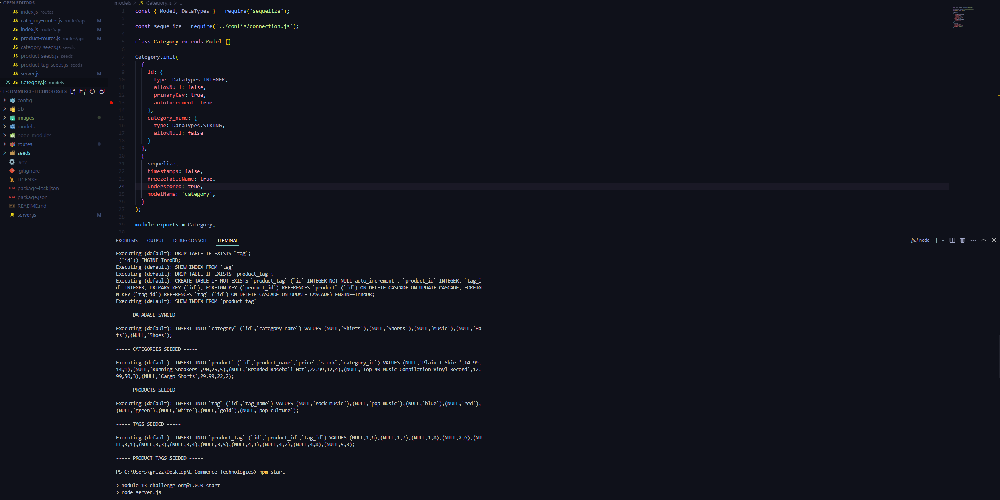
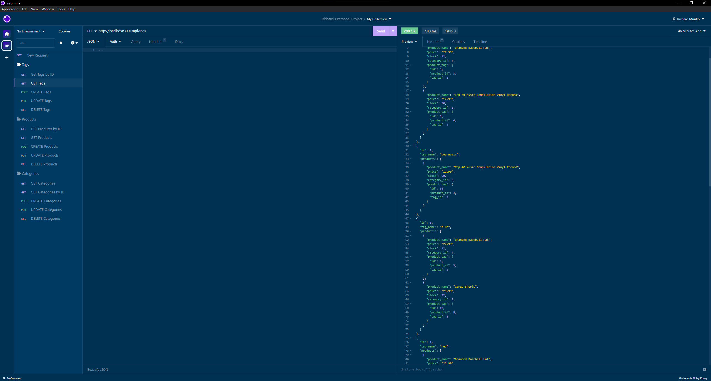

Richard Murillo's README

 # E-Commerce Technologies
 

## Table of Contents

 * [Description](#description)

 * [Installation](#installation)

 * [Usage-Information](#usage-information)

 * [Contribution-Guidelines](#contribution-guidelines)

 * [Screenshots](#screenshots)

 * [License](#license)

 * [Questions](#questions)

## Description

This application creates the backend of a e-comerce website by useing Express.js API and Sequelize to interact with a MySQL database.

## Installation
💾 

it clone the repo https://github.com/RichMur84/E-Commerce-Technologies.git to your local machine. To use this application, please run the following command: 
 
npm install.

## Usage Information
💻

Run the following commands to install the dependencies if you are not sure if they are up to date:
 
npm i inquirer
 
npm i sequelize
 
npm i express
 
 Type the following command in your termimal:
  
 mysql -u root -p 
  
 connect to your database and then run:
  
 source schema.sql 
  
 Quit mySQL shell. 
  
 Run the following command to seed the files:
  
 npm run seed. 
  
 Then run: 
  
 npm start

## Contribution Guidelines

If you would like to contribute, Push to github and wait to be merged. Or contact me by email. Thank you.

## Screenshots
 
 

## DEMO
🎥
 
[VS CODE Set Up](https://drive.google.com/file/d/1_JIjxvPF1PyKw-Fk5ds4nYxZimill0Ns/view)
 
[INSOMNIA DEMO](https://drive.google.com/file/d/1wbDD2WmOvOEEv_rZ99Pp_yxo31grJ8dA/view)

## Used In This Project

## License

NOTICE: This application is covered under the MIT

## Questions

Have additional questions? Click the links below to reach me through my GitHub account or Email address.

[Link to Github](https://github.com/https://github.com/RichMur84)

<a href="mailto:grizzlylbc1@gmail.com">grizzlylbc1@gmail.com</a>

